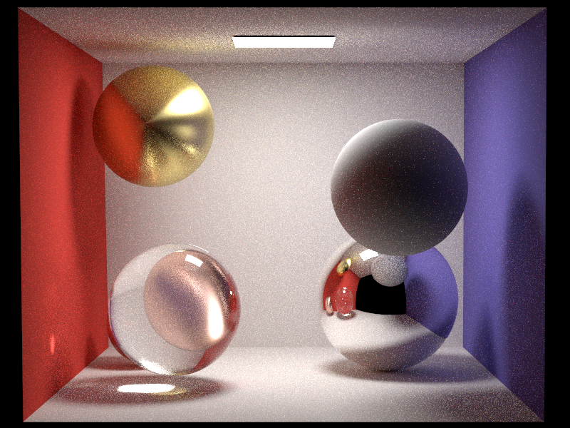

<h1 align="center">RadiantiumPlusPlus</h1>

funny playground

## Introduction

RadiantiumPlusPlus是一个非常简单的光线追踪渲染器, 只是基于兴趣的一个小小项目, 参考了很多很多工程代码教程

## Dependence

使用vcpkg作为包管理

* Embree
* oneTBB
* nlohmann json
* spdlog
* Eigen
* OpenEXR
* stb_image

## Gallery

## License

MIT
