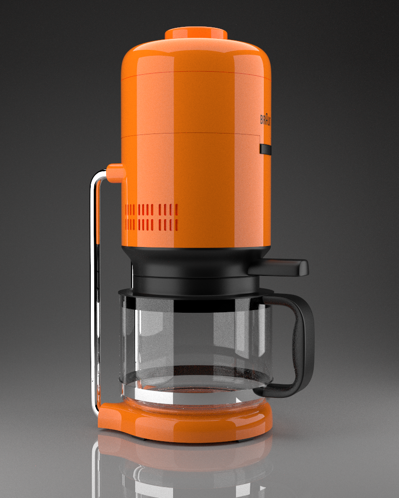

<h1 align="center">RadiantiumPlusPlus</h1>

funny playground

## Introduction

RadiantiumPlusPlus是一个非常简单的光线追踪渲染器, 只是基于兴趣的一个小小项目, 参考了很多很多工程代码教程

## Dependence

使用vcpkg作为包管理

* Embree 3.12.2
* oneTBB 2021.7.0
* nlohmann-json 3.11.2
* spdlog 1.11.0
* Eigen 3.4.0
* OpenEXR 3.1.5
* stb_image 2021-09-10
* OpenVDB 10.0.0

如果构建 ~~编辑器~~ 或者带预览窗口的应用需要

* glfw 3.3.8 (可选)
* glad (可选)
* imgui 1.89.1 (可选)

glad已经包含在ext/glad里了，不需要额外安装

~~编辑器太难整了，暂时放弃~~

## Gallery

## License

MIT
